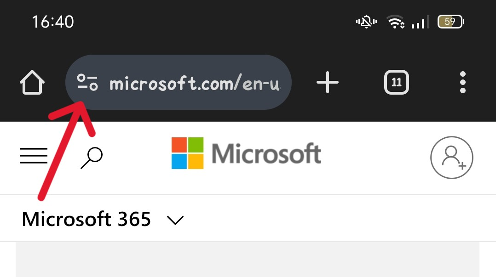
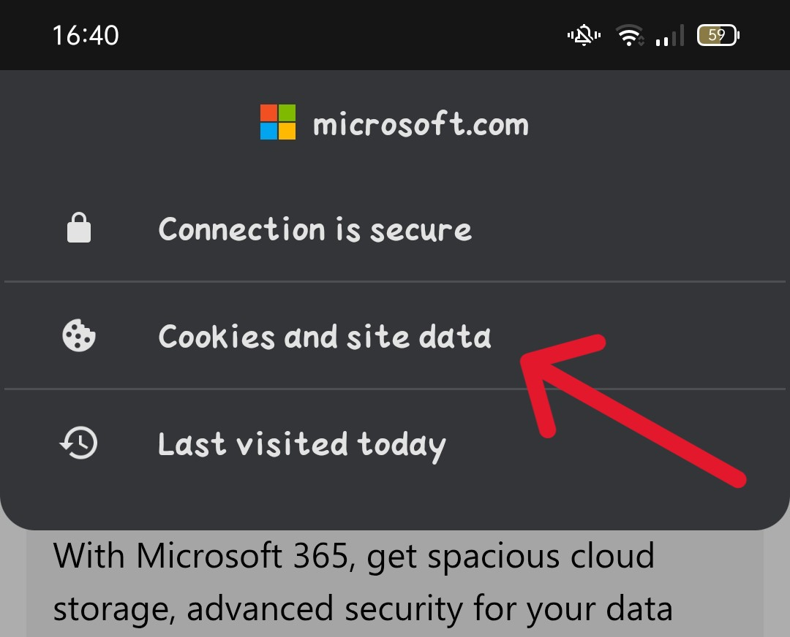
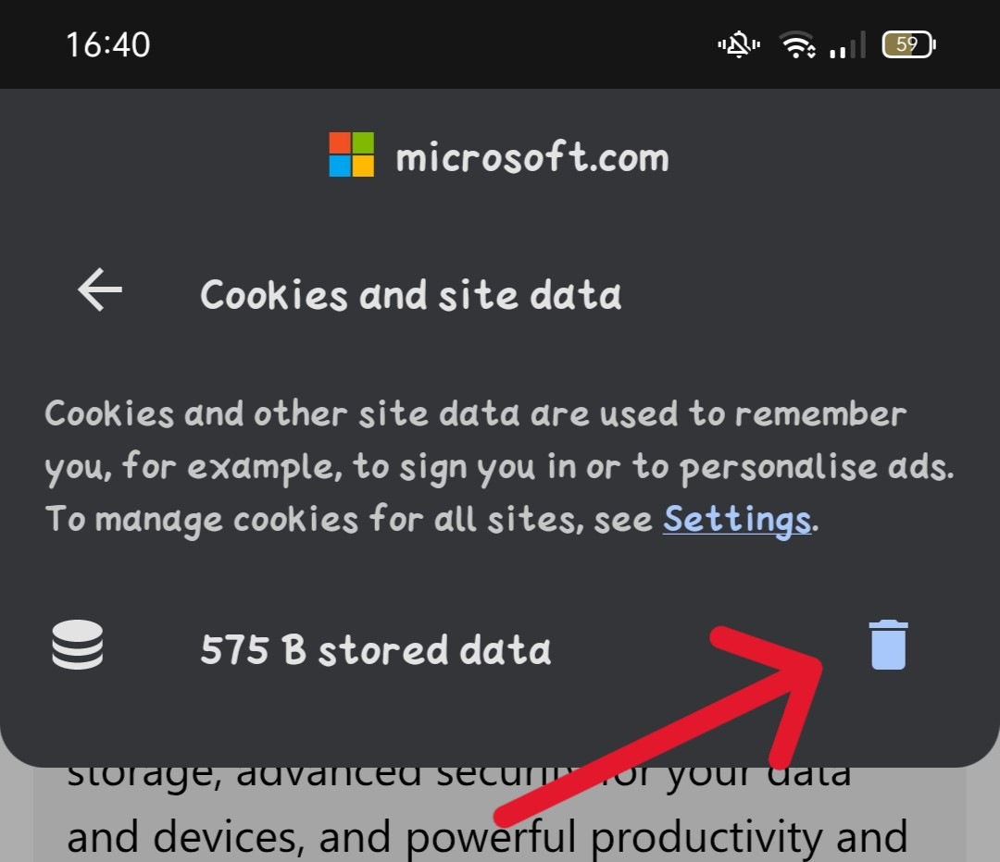
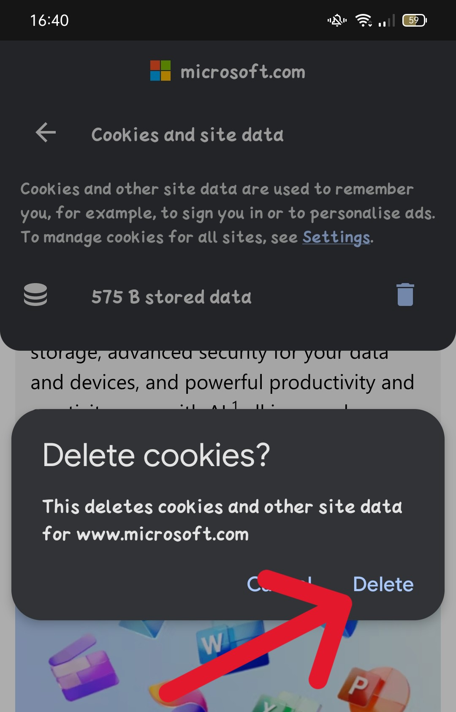

# How to Logout of a website and Delete all its data quickly on chrome android

## Delete all website data
If you want to delete all data in a website and log out if you are logged in, you can quickly achieve that by doing the following:
1) Clicking on the settings button in the top left.
2) Clicking on "Cookies and site data".
2) Clicking on the delete button.
2) Confirming the deletion.

Here are the previous steps explained in pictures:

### 1. Clicking on the settings button in the top left

### 2. Clicking on "Cookies and site data"

### 2. Clicking on the delete button

### 2. Confirming the deletion

 

And there you go, you are done, you have deleted all the data related to that that website from your phone, and if you were logged in, you would have logged out.

Thanks for reading, hope it was useful.
  
  