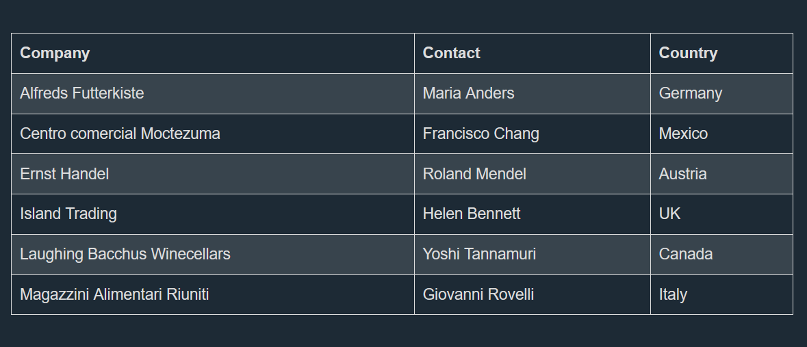
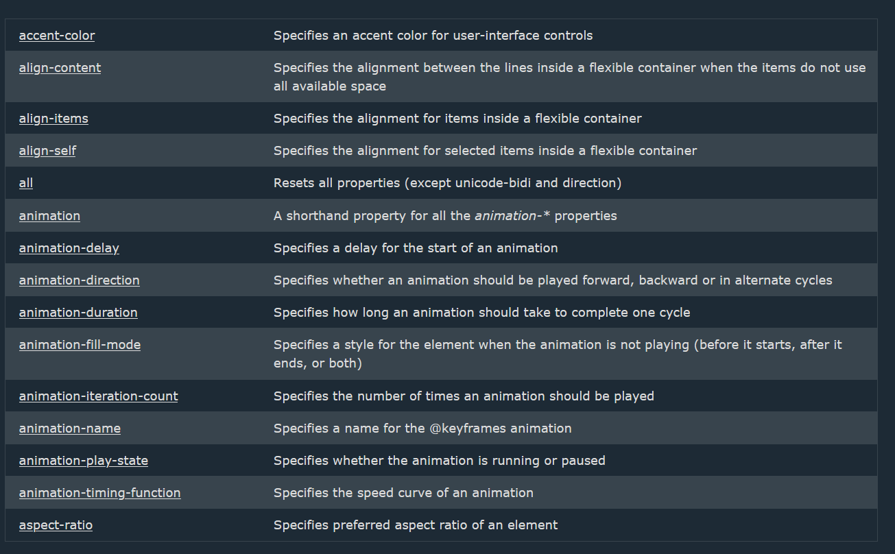

# How to scrape HTML table into JSON using Python (with multiple rowspan and colspan)


## TLDR; Working solution
The next python code works and returns html tables scraped from a web page in a JSON format. <br>
It works when we have a complex header structure with multiple rowspan and colspan as well as complex data structure with &lt;td&gt; elements having multiple rowspan and colspan.<br>
We are using beautiful soup to parse the html, the read_table() method reads a singular table and returns its rows in JSON format.


```py:line-numbers
from bs4 import BeautifulSoup
import json
import requests

# Generates a 2 Dimensional array with the specified row and column count
def gen_matrix(rows, cols):
    matrix = []
    for _ in range(rows):
        row = []
        for _ in range(cols):
            row.append(None)
        matrix.append(row)
    return matrix


# Read data from html table row into a 2D array
def read_table_row_to_array(array, row_index_in_array, row):

    # Get all cells
    cells = row.find_all(["th", "td"])
    current_col = 0

    # For each cell
    for cell in cells:
        # Get colspan, rowspan and data
        colspan = int(cell.get("colspan", 1))
        rowspan = int(cell.get("rowspan", 1))
        text = cell.get_text(strip=True)

        # For each offset in the cell by colspan and rowspan
        for col_offset in range(0, colspan):
            for row_offset in range(0, rowspan):
                # Check if the current cell has been filled by the row above it (if it has a rowspan)
                while (row_index_in_array + row_offset < len(array) and current_col + col_offset < len(array[row_index_in_array + row_offset]) and array[row_index_in_array + row_offset][current_col + col_offset] != None):
                    # Skip it
                    current_col += 1

                if (row_index_in_array + row_offset < len(array) and current_col + col_offset < len(array[row_index_in_array + row_offset])):
                    # Set the current cell value
                    array[row_index_in_array + row_offset][current_col + col_offset] = text

        current_col += colspan


# Read entire table rows and headers into json object
def read_table(table):

    # Read all the rows of the table
    table_rows = table.find_all("tr")

    # Read table headers
    header_rows = [tr for tr in table_rows if tr.find_all("th")]
    
    # Read table data rows
    data_rows = [tr for tr in table_rows if tr.find_all("td")]

    # Whether this table has headers or not
    no_headers = len(header_rows) == 0

    # Get the total number of columns in the table
    if not no_headers:
        col_count = sum(int(cell.get("colspan", 1)) for cell in header_rows[0].find_all("th"))
    else:
        col_count = sum(int(cell.get("colspan", 1)) for cell in data_rows[0].find_all("td"))

    # Initialize the array that will contain the headers content
    if not no_headers:
        headers_array = gen_matrix(len(header_rows), col_count)
    
    # Initialize the array that will contain the rows content
    data_array = gen_matrix(len(data_rows), col_count)

    if not no_headers:
        # Read the headers content into the headers array
        for row_index, row in enumerate(header_rows):
            read_table_row_to_array(headers_array, row_index, row)

    # Read the rows content into the data array
    for row_index, row in enumerate(data_rows):
        read_table_row_to_array(data_array, row_index, row)

    # If there are headers in the table
    if not no_headers:
        # The list of properties we will use in the json object
        property_names = []

        # For each column
        for col in range(col_count):
            property_name = ""
            # For each row in the headers array
            for row in range(len(header_rows)):
                # If it's the first row
                if (row == 0):
                    # Set the property name
                    property_name += headers_array[row][col] + " - "
                # Else, check if the header content is not the same as the previous headers content (row with rowspan > 1)
                elif (headers_array[row - 1][col] != headers_array[row][col]):
                    # Update property name
                    property_name += headers_array[row][col] + " - "

            property_names.append(property_name[:-3])

        # The list of rows to retrieve
        json_object = []

        # For each row
        for idx, row in enumerate(data_array):
            # Create the new object
            new_object = {}

            # For each column
            for i in range(col_count):
                # Get the property name
                prop = property_names[i]

                # If the value is null
                if new_object.get(prop) == None:
                    # Set the property value
                    new_object[prop] = row[i]
                
                # Otherwise
                else:
                    # Check that the value we are gonna set is not the same as the already existing value (needed for colspan > 1)
                    if ((new_object.get(prop) is row[i]) == False):
                        # If the value is empty or a space
                        if (new_object[prop] == "" or str.isspace(new_object[prop]) or row[i] == "" or str.isspace(row[i])):
                            # Set its value
                            new_object[prop] += row[i]
                        # Otherwise
                        else:
                            # Append the property value using a comma
                            new_object[prop] += ", " + row[i]

            # Delete empty keys
            if ("" in new_object):
                del (new_object[""])

            # Add the new row to the extracted rows
            json_object.append(new_object)

    # Table has no headers
    else:

        property_names = []
        
        # Get property list from the first column
        for row in range(len(data_array)):
            property_names.append(data_array[row][0])

        json_object = []
        # For each column
        for col in range(1, col_count):
            # Create the new object
            new_object = {}
            
            # For each row
            for row in range(len(data_array)):
                prop = property_names[row]
                # Set the property value
                new_object[prop] = data_array[row][col]

            # Delete empty keys
            if ("" in new_object):
                del (new_object[""])

            # Add the new row to the extracted rows
            json_object.append(new_object)

    # Create the json object we return
    result = {
        "rows": json_object
    }

    # Return the result
    return result


response = requests.get("https://www.w3schools.com/html/html_tables.asp")

html = response.text

data = []

soup = BeautifulSoup(html, "html.parser")
tables = soup.find_all("table")

for table in tables:
    result = read_table(table)
    data.append(result)


with open("output.json", "w") as file:
    json.dump(data, file, indent=4)

```
For this page [https://www.w3schools.com/html/html_tables.asp](https://www.w3schools.com/html/html_tables.asp) which has tables that are similar to this:



You will get a JSON output similar to this if you run the previous code:

```json
[
    {
        "rows": [
            {
                "Company": "Alfreds Futterkiste",
                "Contact": "Maria Anders",
                "Country": "Germany"
            },
            {
                "Company": "Centro comercial Moctezuma",
                "Contact": "Francisco Chang",
                "Country": "Mexico"
            },
            {
                "Company": "Ernst Handel",
                "Contact": "Roland Mendel",
                "Country": "Austria"
            },
            {
                "Company": "Island Trading",
                "Contact": "Helen Bennett",
                "Country": "UK"
            },
            {
                "Company": "Laughing Bacchus Winecellars",
                "Contact": "Yoshi Tannamuri",
                "Country": "Canada"
            },
            {
                "Company": "Magazzini Alimentari Riuniti",
                "Contact": "Giovanni Rovelli",
                "Country": "Italy"
            }
        ]
    }
]
```


## Reading tables without headers
If you want to scrape a table that does not have a header, the code takes the first column and considers it as the header of the table and reads the rest of the columns from left to right as the value of each row of data.<br>
For example scraping the next page [https://www.w3schools.com/CSSref/index.php](https://www.w3schools.com/CSSref/index.php):



<br>
Gives us JSON that is similar to the following:


```json
[
    {
        "rows": [
            {
                "accent-color": "Specifies an accent color for user-interface controls",
                "align-content": "Specifies the alignment between the lines inside a flexible container when the items do not use all available space",
                "align-items": "Specifies the alignment for items inside a flexible container",
                "align-self": "Specifies the alignment for selected items inside a flexible container",
                "all": "Resets all properties (except unicode-bidi and direction)",
                "animation": "A shorthand property for all theanimation-*properties",
                "animation-delay": "Specifies a delay for the start of an animation",
                "animation-direction": "Specifies whether an animation should be played forward, backward or \n    in alternate cycles",
                "animation-duration": "Specifies how long an animation should take to complete one cycle",
                "animation-fill-mode": "Specifies a style for the element when the animation is not playing (before \n    it starts, after it ends, or both)",
                "animation-iteration-count": "Specifies the number of times an animation should be played",
                "animation-name": "Specifies a name for the @keyframes animation",
                "animation-play-state": "Specifies whether the animation is running or paused",
                "animation-timing-function": "Specifies the speed curve of an animation",
                "aspect-ratio": "Specifies preferred aspect ratio of an element"
            }
        ]
    }
]
```


 
<br>

Thanks for reading, hope it was useful.
  
  